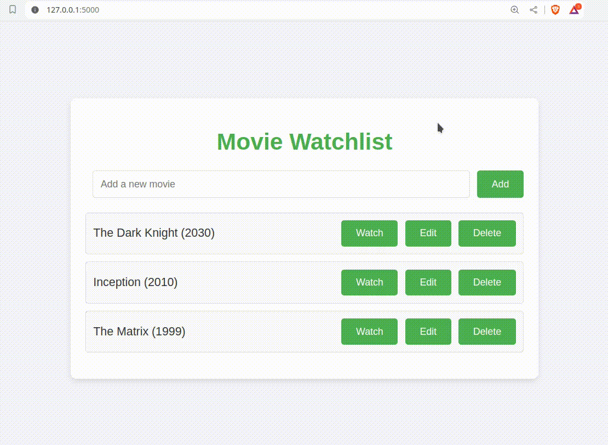

# Flask&HTMX Movie Watchlist Application Example

This demo application allows you to manage a movie watchlist with ease. You can add, edit, and delete movies from the list, as well as mark them as watched or unwatched with a simple click. The application uses Flask for the backend and the HTMX library for dynamic, interactive front-end functionality.



# Project Structure
```
.
├── app.py
├── output.gif
├── README.md
├── static
│   └── style.css
└── templates
    ├── base.html
    ├── index.html
    ├── movie_form.html
    └── movie_list.html
```
